# entertain — Detailed data model

> Draft for review and approval. Version 0.2 (updated for Specs 013–016).
> Model of the **complete vision**. The lean MVP implements a subset of it; the
> phases activate the rest without redesigning anything. Each entity indicates
> the phase in which it is activated.

---

## 1. Schema conventions

- **Identifiers in English, `snake_case`** (tables and columns), to avoid accents
  in identifiers and for tooling convenience. The Catalan labels in earlier
  drafts were for shared comprehension only; this document uses English
  throughout.
- **Primary key:** `id uuid` with `gen_random_uuid()` on every table.
- **Standard fields on every table** (not repeated in the per-entity tables):
  `created_at timestamptz` and `updated_at timestamptz`, default `now()`;
  `updated_at` maintained by trigger.
- **Soft delete:** catalog and history tables carry a nullable `deleted_at
  timestamptz` (marked with 🗑). The rest use physical delete.
- **Foreign keys:** all indexed. Additional indexes are noted per entity.
- **Enums:** implemented as PostgreSQL `enum` types.
- **Isolation:** every table with user data carries `group_id`; RLS policies
  depend on it (see §4).
- **Multilingual:** app-provided content is translated via the `translations`
  table; user-created content is monolingual (§5).

---

## 2. Relationship diagram

```mermaid
erDiagram
    GROUPS ||--o{ MEMBERSHIPS : has
    PROFILES ||--o{ MEMBERSHIPS : has
    GROUPS ||--o{ EVENTS : contains
    GROUPS ||--o{ DISHES : contains
    GROUPS ||--o{ DRINKS : contains
    GROUPS ||--o{ INGREDIENTS : contains
    GROUPS ||--o{ GROUP_SUPPLIER_SETTINGS : contains
    GROUPS ||--o{ PERSONS : contains
    GROUPS ||--o{ MATERIAL_ITEMS : contains
    GROUPS ||--o{ PANTRY_ITEMS : contains
    GROUPS ||--o{ MESSAGE_TEMPLATES : contains

    EVENTS ||--o{ EVENT_DISHES : includes
    EVENTS ||--o{ EVENT_DRINKS : includes
    DISHES ||--o{ DISH_INGREDIENTS : recipe
    DISHES ||--o| EVENT_DISHES : origin
    DISHES ||--o| RECIPES : has
    DRINKS ||--o| EVENT_DRINKS : origin
    EVENT_DISHES ||--o{ EVENT_DISH_INGREDIENTS : copy
    EVENT_DISHES ||--o{ RATINGS : receives
    INGREDIENTS ||--o{ DISH_INGREDIENTS : used
    INGREDIENTS ||--o{ EVENT_DISH_INGREDIENTS : used
    UNITS ||--o{ INGREDIENTS : unit
    UNITS ||--o{ DISH_INGREDIENTS : unit
    UNITS ||--o{ EVENT_DISH_INGREDIENTS : unit

    SUPPLIER_CATEGORIES ||--o{ INGREDIENTS : category
    SUPPLIER_CATEGORIES ||--o{ GROUP_SUPPLIER_SETTINGS : category
    SUPPLIER_CATEGORIES ||--o{ DISHES : "bought category"
    SUPPLIER_CATEGORIES ||--o{ DRINKS : category
    SUPPLIER_CATEGORIES ||--o{ EVENT_DISH_INGREDIENTS : assigned
    SUPPLIER_CATEGORIES ||--o{ ORDERS : groups
    EVENTS ||--o{ ORDERS : generates
    GROUP_SUPPLIER_SETTINGS ||--o| ORDERS : assigned
    ORDERS ||--o{ ORDER_ITEMS : contains
    ORDER_ITEMS ||--o| COSTS : has

    EVENTS ||--o{ EVENT_PARTICIPANTS : invites
    PERSONS ||--o{ EVENT_PARTICIPANTS : attends
    PERSONS ||--o{ DIETARY_RESTRICTIONS : has
    EVENTS ||--o{ COST_SHARES : splits
    PERSONS ||--o{ COST_SHARES : owes

    EVENTS ||--o{ EVENT_MATERIALS : needs
    MATERIAL_ITEMS ||--o| EVENT_MATERIALS : references
    EVENTS ||--o{ TASKS : requires
    PROFILES ||--o{ TASKS : assigned
```

*Media (`media`) and translations (`translations`) are cross-cutting and are
associated polymorphically with multiple entities; they are omitted from the
diagram for clarity (see §3.9).*

---

## 3. Entities

### 3.1 Organization and access

#### `groups` — Group / workspace · Phase 0
Isolation unit for all data. In the MVP, one implicit group per user; Phase 2
adds members.

| Field | Type | Notes |
|---|---|---|
| name | text | Group name; default generated ("My group"). |

#### `profiles` — User profile · Phase 0 🗑
Extension of the Supabase auth user (`auth.users`).

| Field | Type | Notes |
|---|---|---|
| id | uuid | PK; equal to `auth.users.id` (not auto-generated). |
| display_name | text | Nullable. Name for the message signature (decision A1). |
| locale | enum(ca,es,en) | Interface language; default `ca`. |

#### `memberships` — Member · Phase 0 (roles in Phase 2)
User ↔ group relationship. In the MVP, a single member with `role = owner`.

| Field | Type | Notes |
|---|---|---|
| group_id | uuid | FK → groups. |
| user_id | uuid | FK → profiles. |
| role | enum(owner,host,shopper,cook,guest,supplier) | Default `owner`. Roles become meaningful from Phase 2. |
| | | Unique (`group_id`, `user_id`). |

### 3.2 Events and persons

#### `events` — Event · Phase 0 🗑

| Field | Type | Notes |
|---|---|---|
| group_id | uuid | FK → groups. |
| title | text | |
| type | enum(lunch,dinner,other) | |
| format | enum(seated,buffet,other) | Governs the default value of servings per dish. |
| event_date | date | Nullable. |
| event_time | time | Nullable. |
| location_name | text | Nullable. |
| address | text | Nullable. |
| latitude | numeric | Nullable. |
| longitude | numeric | Nullable. |
| guest_count | integer | Number of guests (decision Q6). Default value of `servings`. |
| notes | text | Nullable. |
| ~~status~~ | ~~enum(planning,confirmed,done)~~ | **Dropped (Spec 010 §2.6).** Unused since Spec 008 §2.4 derived event status (in_preparation / ready / past) at the UI layer from the date and ingredient states. The `event_status` enum type is left in place, unreferenced. |

#### `persons` — Person · Phase 1 🗑
Contacts: guests, cooks, etc. Independent of `profiles`.

| Field | Type | Notes |
|---|---|---|
| group_id | uuid | FK → groups. |
| name | text | |
| address | text | Nullable. |
| latitude / longitude | numeric | Nullable. |
| notes | text | Nullable. |

#### `event_participants` — Participation · Phase 2

| Field | Type | Notes |
|---|---|---|
| event_id | uuid | FK → events. |
| person_id | uuid | FK → persons. |
| rsvp_status | enum(pending,yes,no,maybe) | Default `pending`. |
| | | Unique (`event_id`, `person_id`). |

#### `dietary_restrictions` — Dietary restriction · Phase 2

| Field | Type | Notes |
|---|---|---|
| person_id | uuid | FK → persons. |
| type | enum(allergy,intolerance,preference) | |
| label | text | E.g. "seafood", "gluten", "vegetarian". |
| notes | text | Nullable. |

### 3.3 Menu catalog

#### `units` — Unit · Phase 0 · system content
Catalog of units. Automatic conversion only within the same mass or volume
magnitude.

| Field | Type | Notes |
|---|---|---|
| code | text | Short identifier ('g','kg','ml','l','unit','bunch','jar','tray'...). Unique. |
| magnitude | enum(mass,volume,count,package) | |
| base_factor | numeric | Factor toward the magnitude's canonical unit (g for mass, ml for volume). `1` for g/ml; `1000` for kg/l. Null for `count` and `package`. |
| is_system | boolean | Default `true`. Name translated via `translations`. |

#### `ingredients` — Ingredient · Phase 0 🗑
Each ingredient has **a single unit** or a convertible family (decision Q2).

| Field | Type | Notes |
|---|---|---|
| group_id | uuid | FK → groups. Null if system content. |
| name | text | Monolingual if user-created; translated via `translations` if system. |
| default_unit_id | uuid | FK → units. Fixes the magnitude allowed for this ingredient. |
| default_supplier_category_id | uuid | FK → supplier_categories. Nullable. |
| prep_description | text | Nullable. Base preparation/handling ("cuttlefish with skin, cleaned, ink sac separate"). |
| package_equiv_value | numeric | Nullable. Optional conversion: mass/volume equivalent of **one** package unit. |
| package_equiv_unit_id | uuid | FK → units (mass or volume). Accompanies `package_equiv_value`. |
| is_system | boolean | Default `false`. |

> The single-photo `photo_path` column (Spec 009 §2.2) was dropped in Wave 2
> (Spec 011 §2.2). Photos live in the polymorphic `media` table (§2.4).

#### `dishes` — Dish · Phase 0 🗑
Reusable canonical recipe (decision Q1a). A dish is either **cooked** from
ingredients or **bought** ready-made (Spec 014; `acquisition_mode`).

| Field | Type | Notes |
|---|---|---|
| group_id | uuid | FK → groups. |
| name | text | |
| category | enum(aperitif,starter,main,dessert,drink,other) | |
| base_servings | integer | Servings of the canonical recipe (cooked) **or servings one purchase unit provides** (bought). Default `4`. Spec 016 reuses this single column for both modes; `servings_per_unit` from Spec 014 was dropped as redundant. |
| description | text | Nullable. |
| acquisition_mode | enum `dish_acquisition_mode`(cooked,bought) | **Spec 014.** Default `cooked`. A bought dish has no ingredient lines; it is a single purchase line. |
| supplier_category_id | uuid | FK → supplier_categories. Nullable; used only when `bought` (Spec 014). |
| ~~purchase_unit~~ | ~~text~~ | **Added Spec 014, dropped Spec 016.** Bought dishes assume a "unit"; the shopping line shows "N × name". |
| ~~servings_per_unit~~ | ~~numeric~~ | **Added Spec 014, dropped Spec 016** (redundant with `base_servings`). |

> The single-photo `photo_path` column (Spec 009 §2.2) was dropped in Wave 2
> (Spec 011 §2.2). Photos live in the polymorphic `media` table (§2.4).

#### `dish_ingredients` — Dish ingredient line (canonical) · Phase 0

| Field | Type | Notes |
|---|---|---|
| dish_id | uuid | FK → dishes. |
| ingredient_id | uuid | FK → ingredients. |
| quantity | numeric | For `base_servings` servings. |
| unit_id | uuid | FK → units. Same magnitude as the ingredient. |
| prep_note | text | Nullable. Overrides `ingredient.prep_description` for this dish. |
| sort_order | integer | |

#### `event_dishes` — Dish within an event (instance) · Phase 0
Instance frozen when the dish is added to the event (the "copy on add" decision).

| Field | Type | Notes |
|---|---|---|
| event_id | uuid | FK → events. |
| source_dish_id | uuid | FK → dishes. Nullable; origin reference only, no cascade. |
| dish_name | text | Snapshot of the name at the moment of adding. |
| category | enum(...) | Snapshot. |
| servings | integer | Servings for this event. Default `events.guest_count`. |
| sort_order | integer | Order / dish within the menu. |
| is_extras | boolean | Default `false`. Spec 011 §2.11. Marks the per-event **phantom "extras" dish**, created lazily to hold shopping items not tied to any real dish (a supplier piggyback). The phantom dish is hidden from the Menu and excluded from status / counters; it carries `servings = 1` so its lines are never servings-scaled. |
| acquisition_mode | enum `dish_acquisition_mode` | **Spec 014.** Snapshot. Default `cooked`. |
| supplier_category_id | uuid | FK → supplier_categories. **Spec 014.** Snapshot; used only when `bought`. |
| servings_per_unit | numeric | **Spec 014, kept by Spec 016.** Per-unit snapshot taken at add time (a copy of the catalog dish's `base_servings` for a bought dish). Distinct from `servings` (to-serve): shopping units = `ceil(servings / servings_per_unit)`. Null for cooked dishes. Not redundant here even though dropped from `dishes` — the event copy must freeze it so later catalog edits don't mutate a planned event. |
| state | enum `ingredient_state` | **Spec 014.** Shopping state of a **bought** dish's single purchase line; default `to_order`. Ignored for cooked dishes (their shopping state lives on `event_dish_ingredients`), so a cooked dish never produces a phantom purchase line. |
| ~~purchase_unit~~ | ~~text~~ | **Added Spec 014, dropped Spec 016.** |

#### `event_dish_ingredients` — Event ingredient line (editable copy) · Phase 0
Copy of `dish_ingredients` made when the dish is added; editable without
affecting the catalog or other events.

| Field | Type | Notes |
|---|---|---|
| event_dish_id | uuid | FK → event_dishes. |
| ingredient_id | uuid | FK → ingredients. Nullable (origin reference). |
| ingredient_name | text | Snapshot. |
| quantity | numeric | Base quantity of the copied line; scaling is computed with `servings`. |
| unit_id | uuid | FK → units. |
| prep_note | text | Nullable. |
| supplier_category_id | uuid | FK → supplier_categories. Assignment for shopping; default is the ingredient's, overridable. |
| sort_order | integer | |

#### `drinks` — Drink (catalog) · Phase 0 (Spec 014) 🗑
Separate catalog from `dishes` (food and drink are entered apart). A drink is
a single non-decomposable purchase line, **units-only** (Spec 016, "Model B"):
no servings, no scaling — bought in whole units of a named denomination.

| Field | Type | Notes |
|---|---|---|
| group_id | uuid | FK → groups. |
| name | text | |
| supplier_category_id | uuid | FK → supplier_categories. Nullable. Editor preselects the system "Begudes" category (editable). |
| denomination | text | **Spec 016.** Code from a predefined app-level list (`bottle`, `can`, `jug`, `unit`, `pack`, `litre`) rendered with ICU plurals in ca/es/en. Default `bottle`. |
| ~~base_servings~~ / ~~servings_per_unit~~ / ~~purchase_unit~~ | | **Added Spec 014, dropped Spec 016** when drinks moved to the units-only model. |

> Photos via the polymorphic `media` table, `entity_type = 'drink'` (Spec 014),
> bucket `drink-photos`. The `media_group_access` policy and the
> `media_validate_entity()` trigger were extended with a `'drink'` branch in
> Spec 016 (the Spec 014 enum value was added without updating them — the
> drink-photo upload bug).

#### `event_drinks` — Drink within an event (instance) · Phase 0 (Spec 014)
Per-event copy of a drink (mirror of `event_dishes`). Immutable snapshot. The
quantity of units is set **manually** — drinks do not scale with guest count.

| Field | Type | Notes |
|---|---|---|
| event_id | uuid | FK → events (cascade). |
| source_drink_id | uuid | FK → drinks. Nullable; origin reference, no cascade. |
| drink_name | text | Snapshot. |
| supplier_category_id | uuid | FK → supplier_categories. Snapshot. |
| denomination | text | **Spec 016.** Snapshot of the denomination code. |
| quantity | integer | **Spec 016.** Number of units, set manually (no guest scaling). Default `1`. Shopping line: "{quantity} {denomination-plural} de {name}". |
| state | enum `ingredient_state` | Shopping state of the drink's single purchase line; default `to_order`. |
| sort_order | integer | |
| ~~servings~~ / ~~servings_per_unit~~ / ~~purchase_unit~~ | | **Added Spec 014, dropped Spec 016** (units-only model).|

### 3.4 Suppliers and shopping

#### `supplier_categories` — Supplier category · Phase 0 · system + extensible

| Field | Type | Notes |
|---|---|---|
| group_id | uuid | FK → groups. Null if system. |
| code | text | 'fishmonger','butcher','greengrocer','supermarket','pantry'... Plus **'prepared'** ("Plats preparats") and **'beverages'** ("Begudes") — system categories added by Spec 014 as sensible defaults for bought dishes and drinks (not a constraint; any category may be used). |
| name | text | Nullable; user-named categories. System categories have null `name`, translated via `translations` by `code`. |
| is_system | boolean | Name translated via `translations` if system. |

#### `group_supplier_settings` — Configured supplier · Phase 0 (multi from Spec 013) 🗑
A concrete supplier a group has configured within a category (name + contact
channel). **Spec 013** removed the old `UNIQUE(group_id, supplier_category_id)`
constraint, so a category can now have **several** suppliers per group, one
marked default. (Earlier drafts modelled a Phase-1 `suppliers` table; the
active model is this one.)

| Field | Type | Notes |
|---|---|---|
| group_id | uuid | FK → groups. |
| supplier_category_id | uuid | FK → supplier_categories. **No longer unique per group** (Spec 013). |
| supplier_name | text | Nullable. |
| channel | enum | Contact channel (e.g. whatsapp). |
| channel_address / phone_address / email_address | text | Nullable contact details. |
| is_default | boolean | **Spec 013.** Default `false`. A partial unique index `(group_id, supplier_category_id) WHERE is_default` enforces ≤1 default per group+category. First supplier added → auto-default; deleting the default promotes another. |

#### `orders` — Order (per-supplier shopping list) · Phase 0
One order per (event, supplier category). Materialized when the list is
generated.

| Field | Type | Notes |
|---|---|---|
| event_id | uuid | FK → events. |
| supplier_category_id | uuid | FK → supplier_categories. |
| supplier_id | uuid | FK → group_supplier_settings (`ON DELETE SET NULL`). **Activated by Spec 013** (previously dormant/null): the concrete supplier chosen at order time when the category has more than one. |
| ~~delivery_deadline~~ | ~~text~~ | **Dropped (Spec 015).** Dead column, always null, superseded by `needed_by_date`. |
| needed_by_date | date | Order delivery/needed-by date. |
| needed_by_time | time | **Spec 015.** Nullable; optional time alongside the date. Null → date only; set → date + time (shown "13:00h"). Nullability is the flag. |
| message_header | text | Message header; snapshot of the template, editable (decision B2). |
| message_footer | text | Message sign-off; same. |
| status | enum(draft,sent) | Default `draft`. |
| | | Unique (`event_id`, `supplier_category_id`). |

#### `order_items` — Shopping item · Phase 0
Order lines, aggregated by ingredient from `event_dish_ingredients`.

| Field | Type | Notes |
|---|---|---|
| order_id | uuid | FK → orders. |
| ingredient_id | uuid | FK → ingredients. Nullable. |
| ingredient_name | text | Snapshot. |
| quantity | numeric | Total aggregated quantity (already scaled). |
| unit_id | uuid | FK → units. |
| prep_note | text | Nullable. |
| status | enum(pending,bought,unavailable) | Default `pending`. "In the shop" mode from Phase 1. |
| sort_order | integer | |

> **Bought dishes & drinks in shopping (Spec 014/016).** Bought dishes and
> drinks flow into the shopping pipeline as synthetic purchase lines (one per
> item, never merged), grouped by supplier alongside ingredient lines, and use
> the Spec 013 supplier selection. A bought dish line is "N × name" with
> N = `ceil(servings / servings_per_unit)`; a drink line is
> "{quantity} {denomination-plural} de {name}". **Known limitation:** sent-order
> history (`order_items` snapshots) does not carry the drink denomination noun —
> the live message and shopping list render it correctly, but historical lines
> show the name without it. `order_items` was not extended with purchase
> metadata (out of scope of Spec 016).

#### `pantry_items` — Pantry item · Phase 1

| Field | Type | Notes |
|---|---|---|
| group_id | uuid | FK → groups. |
| ingredient_id | uuid | FK → ingredients. |
| quantity | numeric | |
| unit_id | uuid | FK → units. |

### 3.5 Costs

#### `costs` — Cost · Phase 1
Cost associated with a shopping item. Receipt scanning (Phase 5) writes to it
automatically.

| Field | Type | Notes |
|---|---|---|
| order_item_id | uuid | FK → order_items. |
| estimated_amount | numeric | Nullable. |
| actual_amount | numeric | Nullable. |
| currency | text | Default `EUR`. |
| source | enum(manual,receipt_ocr) | Default `manual`. |
| receipt_media_id | uuid | FK → media. Nullable; photo of the source receipt (Phase 5). |

#### `cost_shares` — Cost share · Phase 5
Splitting the cost of a shared-cost event.

| Field | Type | Notes |
|---|---|---|
| event_id | uuid | FK → events. |
| person_id | uuid | FK → persons. |
| amount | numeric | Assigned share. |
| currency | text | Default `EUR`. |
| payment_status | enum(pending,paid) | Default `pending`. |
| payment_method | enum(bizum,venmo,other) | Nullable. |
| payment_link | text | Nullable. Payment link or request. |

### 3.6 Materials

#### `material_items` — Material inventory · Phase 1 🗑
Reusable group inventory (decision Q7a): tableware, cutlery, decoration,
accessories.

| Field | Type | Notes |
|---|---|---|
| group_id | uuid | FK → groups. |
| name | text | |
| category | enum(tableware,cutlery,decoration,accessory,other) | |
| quantity_owned | integer | Nullable. |
| notes | text | Nullable. |

#### `event_materials` — Material per event (checklist) · Phase 1

| Field | Type | Notes |
|---|---|---|
| event_id | uuid | FK → events. |
| material_item_id | uuid | FK → material_items. Nullable. |
| name | text | Snapshot / ad-hoc line. |
| quantity_needed | integer | Nullable. |
| checked | boolean | Default `false`. |

### 3.7 Planning

#### `tasks` — Task · Phase 1 (assignment in Phase 2)
Includes the cooking schedule (tasks with `due_at`).

| Field | Type | Notes |
|---|---|---|
| event_id | uuid | FK → events. |
| title | text | |
| description | text | Nullable. |
| type | enum(cooking,shopping,setup,other) | |
| assignee_user_id | uuid | FK → profiles. Nullable; meaningful assignment from Phase 2. |
| due_at | timestamptz | Nullable. |
| status | enum(todo,doing,done) | Default `todo`. |
| sort_order | integer | |

### 3.8 Recipes and rating

#### `recipes` — Recipe · Phase 3

| Field | Type | Notes |
|---|---|---|
| dish_id | uuid | FK → dishes. Unique. |
| steps | jsonb | Ordered list of steps. |
| prep_minutes | integer | Nullable. |
| cook_minutes | integer | Nullable. |

#### `ratings` — Rating · Phase 1

| Field | Type | Notes |
|---|---|---|
| event_dish_id | uuid | FK → event_dishes. Unique. |
| score | integer | 1–5. Nullable. |
| notes | text | Nullable. What was left over, what to change. |

### 3.9 Cross-cutting

#### `media` — Media · Phase 0 (photos; videos deferred)
Polymorphic association with the photo-bearing entities. **Implemented by Spec
010 §2.4** as a lean, purpose-built table (a single carousel of photos per
entity); it replaces the Spec 009 hybrid (a per-event `event_photos` table plus
single `photo_path` columns on dishes/ingredients), now deprecated (see below).

| Field | Type | Notes |
|---|---|---|
| entity_type | enum `media_entity_type`(event,dish,ingredient,drink) | The owning entity kind; implies the Storage bucket. **`drink` added by Spec 014.** |
| entity_id | uuid | Identifier of the owning entity. Polymorphic FK enforced by triggers (Postgres has no native polymorphic FK). |
| path | text | Relative object path inside the bucket (`{entity_id}/{photo_id}.jpg`, or the legacy flat `{entity_id}.jpg` for backfilled single photos). |
| position | integer | Ordering within the carousel; default `0`. The first photo by `position` is the cover. |
| created_at | timestamptz | Secondary sort (tiebreaker for equal `position`). |
| updated_at | timestamptz | |
| | | Index (`entity_type`, `entity_id`, `position`). |

> **Referential integrity & RLS (Spec 010 §2.4).** `entity_id` has no native FK
> (Postgres can't FK polymorphically). A BEFORE INSERT/UPDATE trigger validates
> that it references an existing row in the table named by `entity_type`; AFTER
> DELETE triggers on `events`/`dishes`/`ingredients` clear orphaned media rows
> (a safety net — those entities are *soft*-deleted, so the app also clears
> media rows explicitly on delete). RLS: a single `media_group_access` policy
> reaches the owning entity's `group_id` per `entity_type` via `is_group_member`.
> A GRANT to anon/authenticated is required (table privileges are checked before
> RLS). Bytes live in private Storage buckets (`dish-photos`,
> `ingredient-photos`, `event-photos`, and **`drink-photos`** from Spec 014), EU
> region, gated by analogous storage RLS; the bucket is implied by `entity_type`
> and no blobs are moved.
>
> **Spec 016:** when Spec 014 added `'drink'` to the `media_entity_type` enum it
> did not update the `media_group_access` policy or the `media_validate_entity()`
> trigger (both `CASE entity_type` over event/dish/ingredient only), so drink
> media-row inserts were rejected — the drink-photo upload bug. Spec 016
> recreated both with a `'drink'` branch reaching `drinks.group_id`.
>
> The unused `media_owner_type` / `media_kind` enums from an earlier Phase 0
> design were dropped in Wave 2 (Spec 011 §2.3). Richer media (videos, receipts,
> captions, ordering across mixed owners) can extend this table directly when a
> later phase needs it.

#### `event_photos` — removed (Spec 011 §2.2, Wave 2)

The per-event photo album table (Spec 009 §2.2), superseded by `media` (Spec
010 §2.4) and backfilled into it in Wave 1, was dropped in Wave 2 (Spec 011
§2.2). Photos for every entity now live in `media`.

#### `translations` — Translation · Phase 0
Translations of app-provided content (§5).

| Field | Type | Notes |
|---|---|---|
| entity_type | enum(unit,supplier_category,ingredient,message_template) | |
| entity_id | uuid | Translated entity. |
| locale | enum(ca,es,en) | |
| field | text | Translated field (e.g. `name`). |
| text | text | Translated text. |
| | | Unique (`entity_type`, `entity_id`, `locale`, `field`). |

#### `message_templates` — Message template · Phase 0
Default (system) template and per-group customization; orders snapshot it
(decision B2).

| Field | Type | Notes |
|---|---|---|
| group_id | uuid | FK → groups. Null if it is the system default template. |
| locale | enum(ca,es,en) | |
| header | text | Default header. |
| footer | text | Default sign-off. |
| is_system | boolean | |

---

## 4. Row-level security (RLS)

Single principle: **a row is accessible if the user is a member of its group.**

- Every table with user data has `group_id` (direct, or derivable via FK — e.g.
  `order_items` via `orders.event_id → events.group_id`).
- Base policy: `SELECT/INSERT/UPDATE/DELETE` allowed if a row exists in
  `memberships` with that `group_id` and the current user.
- **MVP:** the anonymous user gets a `group` and a `membership` created
  automatically on first use. The policy works unchanged from day one.
- **Phase 2:** adding more `memberships` does not alter the policy; optionally,
  some operations are restricted by `role`.
- **System content** (`units`, `supplier_categories` and `ingredients` with null
  `group_id`, `translations`, system template): readable by any authenticated
  user; writable only by the service role.
- **Storage:** the media bucket applies analogous RLS by `group_id`.

---

## 5. System content and translations

- **App-provided content** (decision Q5b) — units, supplier categories, the
  MVP's predefined suppliers, an initial catalog of common ingredients, and the
  message templates — is marked with `is_system = true` (or null `group_id`) and
  translated to ca/es/en via `translations`.
- **User-created content** is monolingual, in the language it is written in; it
  does not go through `translations`.
- The interface (labels, buttons) is translated with Flutter's i18n mechanism
  (ARB), independent of this table.

---

## 6. Phased activation

| Phase | Tables / fields activated |
|---|---|
| **0 — Lean MVP** | groups, profiles, memberships, events, units, ingredients, dishes, dish_ingredients, event_dishes, event_dish_ingredients, supplier_categories, orders, order_items, translations, message_templates, media (structure) |
| **0.x — Fast-follow** | use of `media` for photos; editable categories/suppliers |
| **1 — Scale and convenience** | persons, suppliers, pantry_items, costs, material_items, event_materials, tasks, ratings; videos in `media`; `event_dishes.servings` and quantity verification; photos — first via the Spec 009 hybrid (`dishes.photo_path`, `ingredients.photo_path`, `event_photos`), then unified into the polymorphic `media` table (Spec 010 §2.3–§2.4; the hybrid was dropped in Wave 2, Spec 011 §2.2–§2.3) |
| **2 — Collaborative cloud** | event_participants, dietary_restrictions; `memberships.role`; `tasks.assignee_user_id` |
| **3 — AI** | recipes |
| **5 — Costs and payments** | cost_shares; `costs.source = receipt_ocr` and `receipt_media_id` |

---

## 7. Minor implementation decisions

Made within the agreed margin; flag them if you want any changed:

- Table and column identifiers in English `snake_case`.
- `media` with polymorphic association via `owner_type` + `owner_id` (single
  table) instead of multiple nullable foreign keys.
- `recipes.steps` as `jsonb` (ordered list of steps), not a child table, until
  Phase 3 requires otherwise.
- Name snapshots (`dish_name`, `ingredient_name`) on event instances, to
  preserve history even if the catalog is renamed or deleted.
- `orders` and `order_items` materialized when the list is generated (not a
  computed view), so they can hold shopping status, costs, and the message
  snapshot.

---

## 8. Open points for future phases

These do not block the MVP; they will be detailed when the corresponding phase
is planned:

- Receipt scanning (Phase 5): the mapping between a receipt line and an
  `ingredient` will need its own design.
- Per-supplier payment mechanisms (Phase 5): the `payment_link` format depends on
  each platform.
- Possible multi-currency support if some event requires it.

---

## 9. Change log

- **0.2** — Updated for Specs 013–016:
  - **013** — multi-supplier model: `group_supplier_settings` is now 1:N per
    category (dropped the unique constraint) with `is_default` + partial unique
    index; `orders.supplier_id` activated (concrete supplier chosen at order
    time). Replaces the earlier `suppliers` draft table.
  - **014** — prepared dishes (`dishes.acquisition_mode` + bought fields) and a
    new `drinks` / `event_drinks` catalog; `state` on `event_dishes` /
    `event_drinks` for bought purchase lines; `media` `drink` type + bucket; two
    system supplier categories (`prepared`, `beverages`).
  - **015** — `orders.needed_by_time` (optional time); dropped dead
    `orders.delivery_deadline`.
  - **016** — bought dishes simplified to `base_servings` (dropped
    `purchase_unit` / `servings_per_unit` from `dishes`); drinks moved to a
    units-only model (`denomination` + manual `quantity`, no servings/scaling);
    `media` policy/trigger fixed with a `'drink'` branch (drink-photo bug).
- **0.1** — Initial complete-vision model.
