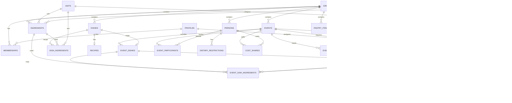

# entertain — Detailed data model

> Draft for review and approval. Version 0.1.
> Model of the **complete vision**. The lean MVP implements a subset of it; the
> phases activate the rest without redesigning anything. Each entity indicates
> the phase in which it is activated.

---

## 1. Schema conventions

- **Identifiers in English, `snake_case`** (tables and columns), to avoid accents
  in identifiers and for tooling convenience. The Catalan labels in earlier
  drafts were for shared comprehension only; this document uses English
  throughout.
- **Primary key:** `id uuid` with `gen_random_uuid()` on every table.
- **Standard fields on every table** (not repeated in the per-entity tables):
  `created_at timestamptz` and `updated_at timestamptz`, default `now()`;
  `updated_at` maintained by trigger.
- **Soft delete:** catalog and history tables carry a nullable `deleted_at
  timestamptz` (marked with 🗑). The rest use physical delete.
- **Foreign keys:** all indexed. Additional indexes are noted per entity.
- **Enums:** implemented as PostgreSQL `enum` types.
- **Isolation:** every table with user data carries `group_id`; RLS policies
  depend on it (see §4).
- **Multilingual:** app-provided content is translated via the `translations`
  table; user-created content is monolingual (§5).

---

## 2. Relationship diagram

*Media (`media`) and translations (`translations`) are cross-cutting and are
associated polymorphically with multiple entities; they are omitted from the
diagram for clarity (see §3.9).*

---

## 3. Entities

### 3.1 Organization and access

#### `groups` — Group / workspace · Phase 0
Isolation unit for all data. In the MVP, one implicit group per user; Phase 2
adds members.

| Field | Type | Notes |
|---|---|---|
| name | text | Group name; default generated ("My group"). |

#### `profiles` — User profile · Phase 0 🗑
Extension of the Supabase auth user (`auth.users`).

| Field | Type | Notes |
|---|---|---|
| id | uuid | PK; equal to `auth.users.id` (not auto-generated). |
| display_name | text | Nullable. Name for the message signature (decision A1). |
| locale | enum(ca,es,en) | Interface language; default `ca`. |

#### `memberships` — Member · Phase 0 (roles in Phase 2)
User ↔ group relationship. In the MVP, a single member with `role = owner`.

| Field | Type | Notes |
|---|---|---|
| group_id | uuid | FK → groups. |
| user_id | uuid | FK → profiles. |
| role | enum(owner,host,shopper,cook,guest,supplier) | Default `owner`. Roles become meaningful from Phase 2. |
| | | Unique (`group_id`, `user_id`). |

### 3.2 Events and persons

#### `events` — Event · Phase 0 🗑

| Field | Type | Notes |
|---|---|---|
| group_id | uuid | FK → groups. |
| title | text | |
| type | enum(lunch,dinner,other) | |
| format | enum(seated,buffet,other) | Governs the default value of servings per dish. |
| event_date | date | Nullable. |
| event_time | time | Nullable. |
| location_name | text | Nullable. |
| address | text | Nullable. |
| latitude | numeric | Nullable. |
| longitude | numeric | Nullable. |
| guest_count | integer | Number of guests (decision Q6). Default value of `servings`. |
| notes | text | Nullable. |
| status | enum(planning,confirmed,done) | Default `planning`. |

#### `persons` — Person · Phase 1 🗑
Contacts: guests, cooks, etc. Independent of `profiles`.

| Field | Type | Notes |
|---|---|---|
| group_id | uuid | FK → groups. |
| name | text | |
| address | text | Nullable. |
| latitude / longitude | numeric | Nullable. |
| notes | text | Nullable. |

#### `event_participants` — Participation · Phase 2

| Field | Type | Notes |
|---|---|---|
| event_id | uuid | FK → events. |
| person_id | uuid | FK → persons. |
| rsvp_status | enum(pending,yes,no,maybe) | Default `pending`. |
| | | Unique (`event_id`, `person_id`). |

#### `dietary_restrictions` — Dietary restriction · Phase 2

| Field | Type | Notes |
|---|---|---|
| person_id | uuid | FK → persons. |
| type | enum(allergy,intolerance,preference) | |
| label | text | E.g. "seafood", "gluten", "vegetarian". |
| notes | text | Nullable. |

### 3.3 Menu catalog

#### `units` — Unit · Phase 0 · system content
Catalog of units. Automatic conversion only within the same mass or volume
magnitude.

| Field | Type | Notes |
|---|---|---|
| code | text | Short identifier ('g','kg','ml','l','unit','bunch','jar','tray'...). Unique. |
| magnitude | enum(mass,volume,count,package) | |
| base_factor | numeric | Factor toward the magnitude's canonical unit (g for mass, ml for volume). `1` for g/ml; `1000` for kg/l. Null for `count` and `package`. |
| is_system | boolean | Default `true`. Name translated via `translations`. |

#### `ingredients` — Ingredient · Phase 0 🗑
Each ingredient has **a single unit** or a convertible family (decision Q2).

| Field | Type | Notes |
|---|---|---|
| group_id | uuid | FK → groups. Null if system content. |
| name | text | Monolingual if user-created; translated via `translations` if system. |
| default_unit_id | uuid | FK → units. Fixes the magnitude allowed for this ingredient. |
| default_supplier_category_id | uuid | FK → supplier_categories. Nullable. |
| prep_description | text | Nullable. Base preparation/handling ("cuttlefish with skin, cleaned, ink sac separate"). |
| package_equiv_value | numeric | Nullable. Optional conversion: mass/volume equivalent of **one** package unit. |
| package_equiv_unit_id | uuid | FK → units (mass or volume). Accompanies `package_equiv_value`. |
| photo_path | text | Nullable. Object path of the ingredient's main photo in the `ingredient-photos` bucket (`{ingredient_id}.jpg`); Spec 009 §2.2. See the photos note in §3.9. |
| is_system | boolean | Default `false`. |

#### `dishes` — Dish · Phase 0 🗑
Reusable canonical recipe (decision Q1a).

| Field | Type | Notes |
|---|---|---|
| group_id | uuid | FK → groups. |
| name | text | |
| category | enum(aperitif,starter,main,dessert,drink,other) | |
| base_servings | integer | Servings of the canonical recipe. Default `4`. |
| description | text | Nullable. |
| photo_path | text | Nullable. Object path of the dish's main photo in the `dish-photos` bucket (`{dish_id}.jpg`); Spec 009 §2.2. See the photos note in §3.9. |

#### `dish_ingredients` — Dish ingredient line (canonical) · Phase 0

| Field | Type | Notes |
|---|---|---|
| dish_id | uuid | FK → dishes. |
| ingredient_id | uuid | FK → ingredients. |
| quantity | numeric | For `base_servings` servings. |
| unit_id | uuid | FK → units. Same magnitude as the ingredient. |
| prep_note | text | Nullable. Overrides `ingredient.prep_description` for this dish. |
| sort_order | integer | |

#### `event_dishes` — Dish within an event (instance) · Phase 0
Instance frozen when the dish is added to the event (the "copy on add" decision).

| Field | Type | Notes |
|---|---|---|
| event_id | uuid | FK → events. |
| source_dish_id | uuid | FK → dishes. Nullable; origin reference only, no cascade. |
| dish_name | text | Snapshot of the name at the moment of adding. |
| category | enum(...) | Snapshot. |
| servings | integer | Servings for this event. Default `events.guest_count`. |
| sort_order | integer | Order / dish within the menu. |

#### `event_dish_ingredients` — Event ingredient line (editable copy) · Phase 0
Copy of `dish_ingredients` made when the dish is added; editable without
affecting the catalog or other events.

| Field | Type | Notes |
|---|---|---|
| event_dish_id | uuid | FK → event_dishes. |
| ingredient_id | uuid | FK → ingredients. Nullable (origin reference). |
| ingredient_name | text | Snapshot. |
| quantity | numeric | Base quantity of the copied line; scaling is computed with `servings`. |
| unit_id | uuid | FK → units. |
| prep_note | text | Nullable. |
| supplier_category_id | uuid | FK → supplier_categories. Assignment for shopping; default is the ingredient's, overridable. |
| sort_order | integer | |

### 3.4 Suppliers and shopping

#### `supplier_categories` — Supplier category · Phase 0 · system + extensible

| Field | Type | Notes |
|---|---|---|
| group_id | uuid | FK → groups. Null if system. |
| code | text | 'fishmonger','butcher','greengrocer','supermarket'... |
| is_system | boolean | Name translated via `translations` if system. |

#### `suppliers` — Concrete supplier · Phase 1 🗑

| Field | Type | Notes |
|---|---|---|
| group_id | uuid | FK → groups. |
| supplier_category_id | uuid | FK → supplier_categories. |
| name | text | E.g. "Marisol". |
| phone | text | Nullable. |
| address | text | Nullable. |
| latitude / longitude | numeric | Nullable. |
| opening_hours | text | Nullable. |
| notes | text | Nullable. |

#### `orders` — Order (per-supplier shopping list) · Phase 0
One order per (event, supplier category). Materialized when the list is
generated.

| Field | Type | Notes |
|---|---|---|
| event_id | uuid | FK → events. |
| supplier_category_id | uuid | FK → supplier_categories. |
| supplier_id | uuid | FK → suppliers. Nullable; assignment to a concrete shop from Phase 1. |
| delivery_deadline | text | Delivery deadline specific to the order (decision C1); free text ("Friday morning"). |
| message_header | text | Message header; snapshot of the template, editable (decision B2). |
| message_footer | text | Message sign-off; same. |
| status | enum(draft,sent) | Default `draft`. |
| | | Unique (`event_id`, `supplier_category_id`). |

#### `order_items` — Shopping item · Phase 0
Order lines, aggregated by ingredient from `event_dish_ingredients`.

| Field | Type | Notes |
|---|---|---|
| order_id | uuid | FK → orders. |
| ingredient_id | uuid | FK → ingredients. Nullable. |
| ingredient_name | text | Snapshot. |
| quantity | numeric | Total aggregated quantity (already scaled). |
| unit_id | uuid | FK → units. |
| prep_note | text | Nullable. |
| status | enum(pending,bought,unavailable) | Default `pending`. "In the shop" mode from Phase 1. |
| sort_order | integer | |

#### `pantry_items` — Pantry item · Phase 1

| Field | Type | Notes |
|---|---|---|
| group_id | uuid | FK → groups. |
| ingredient_id | uuid | FK → ingredients. |
| quantity | numeric | |
| unit_id | uuid | FK → units. |

### 3.5 Costs

#### `costs` — Cost · Phase 1
Cost associated with a shopping item. Receipt scanning (Phase 5) writes to it
automatically.

| Field | Type | Notes |
|---|---|---|
| order_item_id | uuid | FK → order_items. |
| estimated_amount | numeric | Nullable. |
| actual_amount | numeric | Nullable. |
| currency | text | Default `EUR`. |
| source | enum(manual,receipt_ocr) | Default `manual`. |
| receipt_media_id | uuid | FK → media. Nullable; photo of the source receipt (Phase 5). |

#### `cost_shares` — Cost share · Phase 5
Splitting the cost of a shared-cost event.

| Field | Type | Notes |
|---|---|---|
| event_id | uuid | FK → events. |
| person_id | uuid | FK → persons. |
| amount | numeric | Assigned share. |
| currency | text | Default `EUR`. |
| payment_status | enum(pending,paid) | Default `pending`. |
| payment_method | enum(bizum,venmo,other) | Nullable. |
| payment_link | text | Nullable. Payment link or request. |

### 3.6 Materials

#### `material_items` — Material inventory · Phase 1 🗑
Reusable group inventory (decision Q7a): tableware, cutlery, decoration,
accessories.

| Field | Type | Notes |
|---|---|---|
| group_id | uuid | FK → groups. |
| name | text | |
| category | enum(tableware,cutlery,decoration,accessory,other) | |
| quantity_owned | integer | Nullable. |
| notes | text | Nullable. |

#### `event_materials` — Material per event (checklist) · Phase 1

| Field | Type | Notes |
|---|---|---|
| event_id | uuid | FK → events. |
| material_item_id | uuid | FK → material_items. Nullable. |
| name | text | Snapshot / ad-hoc line. |
| quantity_needed | integer | Nullable. |
| checked | boolean | Default `false`. |

### 3.7 Planning

#### `tasks` — Task · Phase 1 (assignment in Phase 2)
Includes the cooking schedule (tasks with `due_at`).

| Field | Type | Notes |
|---|---|---|
| event_id | uuid | FK → events. |
| title | text | |
| description | text | Nullable. |
| type | enum(cooking,shopping,setup,other) | |
| assignee_user_id | uuid | FK → profiles. Nullable; meaningful assignment from Phase 2. |
| due_at | timestamptz | Nullable. |
| status | enum(todo,doing,done) | Default `todo`. |
| sort_order | integer | |

### 3.8 Recipes and rating

#### `recipes` — Recipe · Phase 3

| Field | Type | Notes |
|---|---|---|
| dish_id | uuid | FK → dishes. Unique. |
| steps | jsonb | Ordered list of steps. |
| prep_minutes | integer | Nullable. |
| cook_minutes | integer | Nullable. |

#### `ratings` — Rating · Phase 1

| Field | Type | Notes |
|---|---|---|
| event_dish_id | uuid | FK → event_dishes. Unique. |
| score | integer | 1–5. Nullable. |
| notes | text | Nullable. What was left over, what to change. |

### 3.9 Cross-cutting

#### `media` — Media · Phase 0 (photos in 0.x; videos in Phase 1)
Polymorphic association with multiple entities.

| Field | Type | Notes |
|---|---|---|
| group_id | uuid | FK → groups. |
| owner_type | enum(event,dish,ingredient,person,supplier,material,receipt) | |
| owner_id | uuid | Identifier of the owning entity. |
| kind | enum(photo,video) | |
| storage_path | text | Path in Supabase Storage. |
| caption | text | Nullable. |
| sort_order | integer | |
| | | Index (`owner_type`, `owner_id`). |

> **Photos (Spec 009 §2.2).** The first photo feature (one photo per dish, one
> per ingredient, an album per event) is implemented **not** through the
> polymorphic `media` table above but with a simpler per-entity design, chosen
> deliberately for three entities with fixed cardinalities:
> - `dishes.photo_path` and `ingredients.photo_path` — a single nullable column
>   each (object `{id}.jpg`), so "has a photo" is just "column non-null".
> - `event_photos` — a dedicated child table for the multi-photo event album
>   (below).
>
> Bytes live in three private Supabase Storage buckets (`dish-photos`,
> `ingredient-photos`, `event-photos`), EU region, gated by RLS on group
> membership. `media` remains the model for richer/polymorphic media (videos,
> receipts, captions, ordering across mixed owners) if a later phase needs it.

#### `event_photos` — Event photo album · Phase 1
Multiple photos per event, presented as a carousel (Spec 009 §2.2).

| Field | Type | Notes |
|---|---|---|
| event_id | uuid | FK → events, `on delete cascade`. |
| photo_path | text | Object path in the `event-photos` bucket (`{event_id}/{photo_id}.jpg`). |
| position | integer | Ordering within the carousel; default `0`. New photos append at the current count. |
| created_at | timestamptz | Secondary sort (tiebreaker for equal `position`). |
| | | Index (`event_id`, `position`). |

#### `translations` — Translation · Phase 0
Translations of app-provided content (§5).

| Field | Type | Notes |
|---|---|---|
| entity_type | enum(unit,supplier_category,ingredient,message_template) | |
| entity_id | uuid | Translated entity. |
| locale | enum(ca,es,en) | |
| field | text | Translated field (e.g. `name`). |
| text | text | Translated text. |
| | | Unique (`entity_type`, `entity_id`, `locale`, `field`). |

#### `message_templates` — Message template · Phase 0
Default (system) template and per-group customization; orders snapshot it
(decision B2).

| Field | Type | Notes |
|---|---|---|
| group_id | uuid | FK → groups. Null if it is the system default template. |
| locale | enum(ca,es,en) | |
| header | text | Default header. |
| footer | text | Default sign-off. |
| is_system | boolean | |

---

## 4. Row-level security (RLS)

Single principle: **a row is accessible if the user is a member of its group.**

- Every table with user data has `group_id` (direct, or derivable via FK — e.g.
  `order_items` via `orders.event_id → events.group_id`).
- Base policy: `SELECT/INSERT/UPDATE/DELETE` allowed if a row exists in
  `memberships` with that `group_id` and the current user.
- **MVP:** the anonymous user gets a `group` and a `membership` created
  automatically on first use. The policy works unchanged from day one.
- **Phase 2:** adding more `memberships` does not alter the policy; optionally,
  some operations are restricted by `role`.
- **System content** (`units`, `supplier_categories` and `ingredients` with null
  `group_id`, `translations`, system template): readable by any authenticated
  user; writable only by the service role.
- **Storage:** the media bucket applies analogous RLS by `group_id`.

---

## 5. System content and translations

- **App-provided content** (decision Q5b) — units, supplier categories, the
  MVP's predefined suppliers, an initial catalog of common ingredients, and the
  message templates — is marked with `is_system = true` (or null `group_id`) and
  translated to ca/es/en via `translations`.
- **User-created content** is monolingual, in the language it is written in; it
  does not go through `translations`.
- The interface (labels, buttons) is translated with Flutter's i18n mechanism
  (ARB), independent of this table.

---

## 6. Phased activation

| Phase | Tables / fields activated |
|---|---|
| **0 — Lean MVP** | groups, profiles, memberships, events, units, ingredients, dishes, dish_ingredients, event_dishes, event_dish_ingredients, supplier_categories, orders, order_items, translations, message_templates, media (structure) |
| **0.x — Fast-follow** | use of `media` for photos; editable categories/suppliers |
| **1 — Scale and convenience** | persons, suppliers, pantry_items, costs, material_items, event_materials, tasks, ratings; videos in `media`; `event_dishes.servings` and quantity verification; photos (`dishes.photo_path`, `ingredients.photo_path`, `event_photos`) — Spec 009 §2.2 |
| **2 — Collaborative cloud** | event_participants, dietary_restrictions; `memberships.role`; `tasks.assignee_user_id` |
| **3 — AI** | recipes |
| **5 — Costs and payments** | cost_shares; `costs.source = receipt_ocr` and `receipt_media_id` |

---

## 7. Minor implementation decisions

Made within the agreed margin; flag them if you want any changed:

- Table and column identifiers in English `snake_case`.
- `media` with polymorphic association via `owner_type` + `owner_id` (single
  table) instead of multiple nullable foreign keys.
- `recipes.steps` as `jsonb` (ordered list of steps), not a child table, until
  Phase 3 requires otherwise.
- Name snapshots (`dish_name`, `ingredient_name`) on event instances, to
  preserve history even if the catalog is renamed or deleted.
- `orders` and `order_items` materialized when the list is generated (not a
  computed view), so they can hold shopping status, costs, and the message
  snapshot.

---

## 8. Open points for future phases

These do not block the MVP; they will be detailed when the corresponding phase
is planned:

- Receipt scanning (Phase 5): the mapping between a receipt line and an
  `ingredient` will need its own design.
- Per-supplier payment mechanisms (Phase 5): the `payment_link` format depends on
  each platform.
- Possible multi-currency support if some event requires it.
